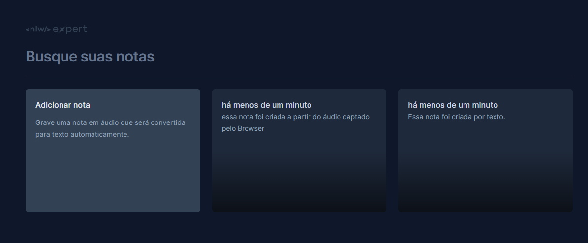

<h1 align="center"> Notes </h1>

<p align="center">
Este é um projeto de uma página que possibilita a criação de notas de texto ou áudio que são convertidos em texto. 
</p>

<p align="center">
  <a href="#-instalação">Instalação</a>&nbsp;&nbsp;&nbsp;|&nbsp;&nbsp;&nbsp;
  <a href="#-exemplos-e-demonstração">Exemplos e Demonstração</a>&nbsp;&nbsp;&nbsp;|&nbsp;&nbsp;&nbsp;
  <a href="#-tecnologias">Tecnologias</a>&nbsp;&nbsp;&nbsp;|&nbsp;&nbsp;&nbsp;
  <a href="#-projeto">Projeto</a>&nbsp;&nbsp;&nbsp;|&nbsp;&nbsp;&nbsp;
  <a href="#memo-licença">Licença</a>
</p>

<p align="center">
  
</p>

<br>

## 👩🏾‍💻 Instalação

Abra um terminal na pasta projeto e execute:

```bash
$ npm install
$ npm run dev
```

## 📺 Exemplos e Demonstração

Por meio da interface, é possível realizar as seguintes ações:

- Criar uma nota de texto digitando pelo teclado.
- Criar uma nota de texto utilizando áudio captado pelo navegador.
- Buscar notas criadas por texto.
- Apagar notas de texto previamente criadas.
- Identificar a data de criação de uma nota.

<p align="center">
  
</p>

## 🚀 Tecnologias

Esse projeto foi desenvolvido com as seguintes tecnologias:

- HTML e CSS
- Tailwind
- Typescript
- Vite
- Git e Github
- React 
- Figma

## 💻 Projeto

Essa página foi desenvolvida com base a partir no NLW Expert, um evento gratuito da Rocketseat. 

## :memo: Licença

Licença by MIT.

---

Rocketseat: [Link da Rocketseat!](https://discord.gg/rocketseat)
